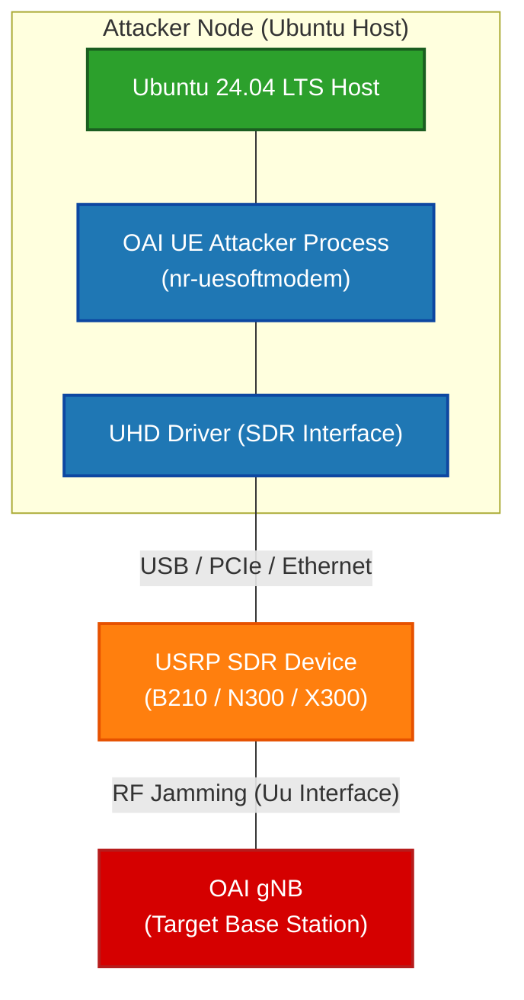

# MSG1 Jamming Attacker based on OAI Deployment Manual


> **Author**: 黃仁廷 (JTFinn)
> **Date Created**: 2026-07-26

> ⚠️ **Critical Safety Note**
> This manual outlines the procedure for configuring, building, and running the MSG1 Jamming Attacker based on the OpenAirInterface (OAI) UE. This tool is strictly designed for security testing and academic research. **It MUST be executed in a properly isolated RF environment** (e.g., using direct coaxial cable connections with attenuators, or inside an RF Shield Box) to prevent illegal interference with commercial 5G telecommunication networks.

---

## Table of Contents
- [1. Executive Summary](#1-executive-summary)
- [2. Architecture and Topology](#2-architecture-and-topology)
- [3. Prerequisites](#3-prerequisites)
- [4. Step-by-Step Guide](#4-step-by-step-guide)
  - [4.1 Workspace Setup and Source Code Cloning](#41-workspace-setup-and-source-code-cloning)
  - [4.2 Build UHD Driver from Source](#42-build-uhd-driver-from-source)
  - [4.3 Build MSG1 Attacker](#43-build-msg1-attacker)
  - [4.4 Quick Re-build (After Code Edit)](#44-quick-re-build-after-code-edit)
  - [4.5 Execute Attacker](#45-execute-attacker)
- [5. Available Options & Parameters](#5-available-options--parameters)

---

## 1. Executive Summary
This document provides a standardized operating procedure for compiling and executing the MSG1 Jamming Attacker. By modifying the OpenAirInterface (OAI) User Equipment (UE) source code, this tool leverages a Software Defined Radio (SDR) device to continuously transmit MSG1 (PRACH Preamble) signals towards a target 5G Base Station (gNB). This capability is primarily used to evaluate gNB resilience against Random Access Channel (RACH) flooding or synchronization jamming attacks in a controlled testing environment.

---

## 2. Architecture and Topology
The system architecture isolates the attacker node from the target gNB. The attacker host uses the customized OAI UE softmodem to command the SDR via the UHD driver, sending jamming signals over the Uu interface.



---

## 3. Prerequisites
Ensure the hardware, operating system, and safety environments meet the minimum requirements before proceeding with the build process.

*   **Host Machine**: x86_64 architecture CPU (Minimum 8 cores @ 3.5 GHz), 8 GB RAM.
    *   *Note: It is highly recommended to run the attacker on a separate, dedicated host from the target gNB.*
*   **Operating System**: Ubuntu 24.04 LTS (Native installation is recommended to ensure stable USB/PCIe passthrough for the SDR).
*   **Supported SDR Hardware**: USRP B210, USRP N300, or USRP X300.
    *   Identify the network interface(s) or USB ports where the USRP is connected and ensure sufficient power supply.
*   **RF Safety Equipment**: Coaxial cables paired with appropriate RF attenuators, or a Faraday cage, are mandatory for execution. Do not transmit over-the-air (OTA) without isolation.

---

## 4. Step-by-Step Guide

### 4.1 Workspace Setup and Source Code Cloning
To maintain a clean system directory, we will centralize all OAI projects within a dedicated workspace and clone the customized branch that supports the O1 interface and alert functionalities.

```bash
mkdir ~/oai_workspace
cd ~/oai_workspace

git clone [https://github.com/bmw-ece-ntust/Richard-oai-gNB.git](https://github.com/bmw-ece-ntust/Richard-oai-gNB.git) OAI-gNB-O1
cd OAI-gNB-O1

git switch O1-telnet-alert
```

### 4.2 Installing Dependencies
Before compiling, it is necessary to install the required system dependencies. By executing the build script with the `-I` parameter, the system will automatically handle all necessary environments, including the USRP drivers:

```bash
cd ~/oai_workspace/OAI-gNB-O1/cmake_targets/

./build_oai -I
```

### 4.3 Build gNB and Telnet Module
Use Ninja for multi-core accelerated compilation, and ensure the Telnet Server (`telnetsrv`) shared library is built alongside it. This is a critical prerequisite for the O1 Adapter connection.

```bash
sudo ./build_oai --ninja -c --gNB --nrUE --build-lib telnetsrv -w USRP -C    
```

> ⚠️ **Note on `sudo` usage:**
> Generally, do not use `sudo` with `./build_oai` as it may cause system permission errors. `sudo` is typically only required in Step 4.4 to access hardware interfaces. However, if your specific environment throws a permission error during compilation without it, you may append `sudo` to proceed.

**Core Parameter Description:**
*   `--ninja`: Uses `Ninja` instead of the traditional `make` to accelerate the build process.
*   `-c`: Cleans the previous build workspace.
*   `--gNB` / `--nrUE`: Specifies building the 5G Base Station (gNB) and User Equipment (nrUE) executables.
*   `--build-lib telnetsrv`: **[Critical]** Requests the compilation of an additional shared library for the Telnet Server, which is required for O1 Adapter integration.
*   `-w USRP`: Specifies the RF hardware equipment as `USRP`.
*   `-C`: Hard Clean; completely deletes and recreates the CMake build directory.

### 4.4 Run O1 Telnet Enabled Modem
Once the build is complete, navigate to the final `build` directory and start the softmodem using the specified configuration file. The startup command must explicitly enable the Telnet service and load the O1 module.

```bash
cd ~/oai_workspace/OAI-gNB-O1/cmake_targets/ran_build/build

sudo ./nr-softmodem -O ../../../targets/PROJECTS/GENERIC-NR-5GC/CONF/gnb.sa.band78.fr1.106PRB.usrpb210.conf --gNBs.[0].min_rxtxtime 6 -E --continuous-tx --log_config.PRACH_debug --telnetsrv --telnetsrv.shrmod o1
```

**Core Parameter Description:**
*   `-O [path]`: Specifies the path to the initialization configuration file required by the OAI gNB.
*   `--continuous-tx`: Configures the gNB to transmit signals continuously, which is critical for testing transmission stability.
*   `--log_config.PRACH_debug`: Enables debug logs related to PRACH (Physical Random Access Channel) for easier tracking.
*   `--telnetsrv`: Starts the Telnet Server, opening Port 9090 to allow external tools or the O1 Adapter to connect and control the modem.
*   `--telnetsrv.shrmod o1`: Loads the O1 shared module to officially interface with the O1 Adapter.

---

## 5. Configuration and Parameters
The MSG1 Jamming Attacker uses the OAI `nr-uesoftmodem` executable. Proper configuration of RF parameters is required to synchronize with the target gNB. Below are the key parameters used during execution:

### 5.1 Core Execution Parameters
*   `-r <value>`: Number of Resource Blocks (RB). Determines the bandwidth of the transmitted signal (e.g., `106` for 40MHz).
*   `--numerology <value>`: Subcarrier Spacing (SCS). A value of `1` indicates 30 kHz spacing (typical for 5G NR FR1).
*   `--band <value>`: The specific 5G frequency band to operate on (e.g., `78` for n78 / 3.3-3.8 GHz).
*   `-C <frequency>`: The center frequency in Hz. This must strictly match the target gNB's SSB ARFCN converted to Hz (e.g., `3619200000` for ~3.6 GHz).
*   `--ssb <offset>`: The Synchronization Signal Block (SSB) index. The attacker must align with this to transmit the MSG1 precisely.
*   `-E`: Enables External Band Filter or specific hardware enhancements for the RF front-end.
*   `--ue-fo-compensation`: Enables automatic frequency offset compensation to prevent drift caused by hardware thermal issues.

### 5.2 Advanced Attack Options
*   `--seq <value>`: Specifies the number of preambles to include in one root sequence to increase collision probability.
*   `--ue-max-power <value>`: Overrides the UE maximum transmission power limitation.
*   `-ue-txgain <value>`: Adjusts the UE transmit power (Tx Gain). Higher values (e.g., `120`) increase jamming intensity but risk hardware overheating.
*   `-ue-rxgain <value>`: Adjusts the UE receive gain (Rx Gain).

---

## 6. Verification and Safety Guidelines
To verify the execution of the attacker, you must monitor the terminal output for synchronization logs with the gNB. However, **strict RF isolation protocols must be followed** before initiating the transmission.

> 🛑 **CRITICAL SAFETY WARNING: DO NOT TRANSMIT OVER-THE-AIR**
> Currently, the target gNB does not have a USRP connected, meaning a closed-loop, cabled RF testing environment has not been established. **Under no circumstances should you execute the attacker command with an antenna attached to transmit signals into the open air (OTA).**
>
> The configured frequency (n78 band / 3.6 GHz) belongs to licensed commercial 5G spectrum. Transmitting MSG1 jamming signals without a coaxial cable + attenuator setup or a Faraday cage will directly disrupt surrounding public telecommunication networks, violating federal telecom regulations. Wait until both the gNB and Attacker SDRs are physically connected via RF cables before running the execution command.

---

## 7. Troubleshooting

| Symptoms | Root Cause | Solution |
| :--- | :--- | :--- |
| **GitHub Authentication Failed**<br>`remote: Invalid username or token.`<br>`Password authentication is not supported...` | GitHub deprecated account password authentication for command-line Git operations in 2021. | Go to GitHub web **Settings** > **Developer settings** > **Personal access tokens (classic)**. Generate a new token with the `repo` scope checked. When prompted for a password during `git clone`, paste this token (starts with `ghp_`) instead of your account password. |
| **Directory Not Found Cascade Error**<br>`cd: OAI-UE-MSG1-attacker: No such file or directory`<br>`./build_oai: No such file or directory` | This is a cascading failure caused by bulk copy-pasting commands. The `git clone` command failed (due to the auth issue above), so the folder was never created, causing all subsequent commands to fail. | Resolve the GitHub token issue first. Always execute the `git clone` command individually. Verify the repository has been downloaded 100% successfully before running the subsequent `cd` and `build` commands line-by-line. |
| **UHD Device Not Found**<br>`No UHD devices found with address...` | The system cannot detect the USRP B210/X300 device via USB or Ethernet. | Ensure the USRP is properly powered and connected. If using a VM or WSL2, verify that USB/PCIe passthrough is actively forwarding the device to the Linux kernel. Check visibility by running the `uhd_find_devices` command. |

---

## 8. References
* [NTUST Customized MSG1 Attacker Repository (Richard-OAI-UE-MSG1-attacker)](https://github.com/bmw-ece-ntust/Richard-OAI-UE-MSG1-attacker)
* [OpenAirInterface (OAI) Official GitLab Repository](https://gitlab.eurecom.fr/oai/openairinterface5g)
* [Ettus Research UHD (USRP Hardware Driver) Build and Install Guide](https://files.ettus.com/manual/page_build_guide.html)
* [OAI 5G NR Execution and Parameters Documentation (RUNMODEM.md)](https://gitlab.eurecom.fr/oai/openairinterface5g/-/blob/develop/doc/RUNMODEM.md)
* [3GPP TS 38.211: NR; Physical channels and modulation (PRACH Specifications)](https://portal.3gpp.org/desktopmodules/Specifications/SpecificationDetails.aspx?specificationId=3213)
* [GitHub Docs: Managing your personal access tokens (Classic)](https://docs.github.com/en/authentication/keeping-your-account-and-data-secure/managing-your-personal-access-tokens)
