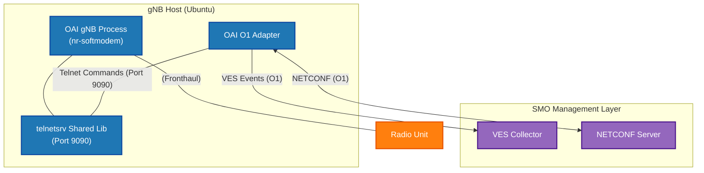

# OAI gNB with O1 Interface (Telnet Enabled) Deployment Manual


> **Author**: 黃仁廷 (JTFinn)
> **Date Created**: 2026-07-26

> ⚠️ **Note**
> This manual outlines the procedure for building and running the OpenAirInterface (OAI) gNB with the `telnetsrv` shared library enabled. This specific configuration is a strict prerequisite for enabling the OAI O1 Adapter to function properly and interface with the SMO Management Layer. 

---

## Table of Contents
- [1. Executive Summary](#1-executive-summary)
- [2. Architecture and Topology](#2-architecture-and-topology)
- [3. Prerequisites](#3-prerequisites)
- [4. Step-by-Step Guide](#4-step-by-step-guide)
  - [4.1 Workspace Setup and Source Code Cloning](#41-workspace-setup-and-source-code-cloning)
  - [4.2 Installing Dependencies](#42-installing-dependencies)
  - [4.3 Build gNB and Telnet Module](#43-build-gnb-and-telnet-module)
  - [4.4 Run O1 Telnet Enabled Modem](#44-run-o1-telnet-enabled-modem)
- [5. Configuration](#5-configuration)
- [6. Verification](#6-verification)
- [7. Troubleshooting](#7-troubleshooting)
- [8. References](#8-references)

---

## 1. Executive Summary
This document provides a standardized operating procedure for compiling, configuring, and executing the OpenAirInterface (OAI) 5G Base Station (gNB) with O1 management capabilities. By compiling a customized branch and enabling the telnet server module (`telnetsrv`), the gNB exposes a control interface on port 9090. This allows the standalone O1 Adapter to connect, enabling critical management functions such as Performance Management (PM), Configuration Management (CM), and Fault Management (FM) via NETCONF and VES protocols. 

---

## 2. Architecture and Topology
The system architecture integrates the traditional OAI RAN components with the SMO (Service Management and Orchestration) layer through the O1 interface. The topology is structured as follows:



---

## 3. Prerequisites
The compilation and execution environment remains identical to the standard OAI 5G SA deployment to ensure consistency and prevent Out of Memory (OOM) crashes during massive C++ parallel builds.

*   **Host Machine**: Acer Predator PHN16-72 (32GB RAM, 32 Logical Cores).
*   **Virtualization Environment**: Windows Subsystem for Linux (WSL2) v2.6.3.
    *   **Performance Tuning Strategy**: The Windows `%userprofile%\.wslconfig` file is explicitly configured to allocate sufficient resources:
        ```ini
        [wsl2]
        memory=24GB
        processors=24
        swap=8GB
        ```
*   **Operating System**: Ubuntu 22.04 LTS (Kernel 6.6.87).

---

## 4. Step-by-Step Guide

### 4.1 Workspace Setup and Source Code Cloning
To maintain a clean system directory, we will centralize all OAI projects within a dedicated workspace and clone the customized branch that supports the O1 interface and alert functionalities.

```bash
mkdir ~/oai_workspace
cd ~/oai_workspace

git clone [https://github.com/bmw-ece-ntust/Richard-oai-gNB.git](https://github.com/bmw-ece-ntust/Richard-oai-gNB.git) OAI-gNB-O1
cd OAI-gNB-O1

git switch O1-telnet-alert
```

### 4.2 Installing Dependencies
Before compiling, it is necessary to install the required system dependencies. By executing the build script with the `-I` parameter, the system will automatically handle all necessary environments, including the USRP drivers:

```bash
cd ~/oai_workspace/OAI-gNB-O1/cmake_targets/

./build_oai -I
```

### 4.3 Build gNB and Telnet Module
Use Ninja for multi-core accelerated compilation, and ensure the Telnet Server (`telnetsrv`) shared library is built alongside it. This is a critical prerequisite for the O1 Adapter connection.

```bash
sudo ./build_oai --ninja -c --gNB --nrUE --build-lib telnetsrv -w USRP -C    
```

> ⚠️ **Note on `sudo` usage:**
> Generally, do not use `sudo` with `./build_oai` as it may cause system permission errors. `sudo` is typically only required in Step 4.4 to access hardware interfaces. However, if your specific environment throws a permission error during compilation without it, you may append `sudo` to proceed.

**Core Parameter Description:**
*   `--ninja`: Uses `Ninja` instead of the traditional `make` to accelerate the build process.
*   `-c`: Cleans the previous build workspace.
*   `--gNB` / `--nrUE`: Specifies building the 5G Base Station (gNB) and User Equipment (nrUE) executables.
*   `--build-lib telnetsrv`: **[Critical]** Requests the compilation of an additional shared library for the Telnet Server, which is required for O1 Adapter integration.
*   `-w USRP`: Specifies the RF hardware equipment as `USRP`.
*   `-C`: Hard Clean; completely deletes and recreates the CMake build directory.

### 4.4 Run O1 Telnet Enabled Modem
Once the build is complete, navigate to the final `build` directory and start the softmodem using the specified configuration file. The startup command must explicitly enable the Telnet service and load the O1 module.

```bash
cd ~/oai_workspace/OAI-gNB-O1/cmake_targets/ran_build/build

sudo ./nr-softmodem -O ../../../targets/PROJECTS/GENERIC-NR-5GC/CONF/gnb.sa.band78.fr1.106PRB.usrpb210.conf --gNBs.[0].min_rxtxtime 6 -E --continuous-tx --log_config.PRACH_debug --telnetsrv --telnetsrv.shrmod o1
```

**Core Parameter Description:**
*   `-O [path]`: Specifies the path to the initialization configuration file required by the OAI gNB.
*   `--continuous-tx`: Configures the gNB to transmit signals continuously, which is critical for testing transmission stability.
*   `--log_config.PRACH_debug`: Enables debug logs related to PRACH (Physical Random Access Channel) for easier tracking.
*   `--telnetsrv`: Starts the Telnet Server, opening Port 9090 to allow external tools or the O1 Adapter to connect and control the modem.
*   `--telnetsrv.shrmod o1`: Loads the O1 shared module to officially interface with the O1 Adapter.
