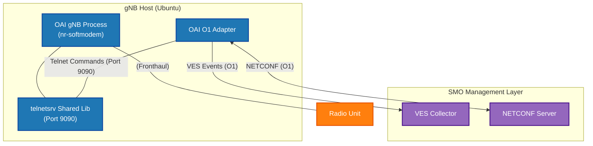

# OAI gNB with O1 Interface (Telnet Enabled) Deployment Manual


> **Author**: 黃仁廷 (JTFinn)
> **Date Created**: 2026-07-26

> ⚠️ **Note**
> This manual outlines the procedure for building and running the OpenAirInterface (OAI) gNB with the `telnetsrv` shared library enabled. This specific configuration is a strict prerequisite for enabling the OAI O1 Adapter to function properly and interface with the SMO Management Layer. 

## 1. Executive Summary
This document provides a standardized operating procedure for compiling, configuring, and executing the OpenAirInterface (OAI) 5G Base Station (gNB) with O1 management capabilities. By compiling a customized branch and enabling the telnet server module (`telnetsrv`), the gNB exposes a control interface on port 9090. This allows the standalone O1 Adapter to connect, enabling critical management functions such as Performance Management (PM), Configuration Management (CM), and Fault Management (FM) via NETCONF and VES protocols. 

## 2. Architecture and Topology
The system architecture integrates the traditional OAI RAN components with the SMO (Service Management and Orchestration) layer through the O1 interface. The topology is structured as follows:



---

## 4. Step-by-Step Guide

### 4.1 Installing Dependencies
Before compiling OAI, it is necessary to install the required system dependencies. By executing the build script with the `-I` parameter, the system will automatically handle all necessary environments, including the USRP drivers:

```bash
cd openairinterface5g/cmake_targets/
./build_oai -I
```

### 4.2 Clone Customized Repository and Build
To support the O1 interface and specific alert functionalities in subsequent steps, we do not use the official main branch. Instead, clone the customized `Richard-oai-gNB` repository, switch to the specific branch, and then perform a parallel build.

```bash
git clone [https://github.com/bmw-ece-ntust/Richard-oai-gNB.git](https://github.com/bmw-ece-ntust/Richard-oai-gNB.git)
git switch O1-telnet-alert
cd openairinterface5g/cmake_targets/
sudo ./build_oai --ninja -c --gNB --nrUE --build-lib telnetsrv -w USRP -C    
```

**Parameter Description:**
*   `sudo`: Executes the command with superuser (root) privileges.
*   `--ninja`: Uses `Ninja` instead of the traditional `make` to accelerate the build process.
*   `-c`: Cleans the previous build workspace.
*   `--gNB`: Specifies building the 5G Base Station (gNB) executable, which generates the `nr-softmodem` program.
*   `--nrUE`: Specifies building the 5G User Equipment (nrUE) executable, which generates the `nr-uesoftmodem` program.
*   `--build-lib telnetsrv`: Requests the compilation of an additional shared library for the **Telnet Server**, which is crucial for the O1 Adapter connection.
*   `-w USRP`: Specifies the RF hardware equipment as `USRP`.
*   `-C`: Hard Clean; completely deletes and recreates the CMake build directory.

### 4.3 Run Modem (O1 Telnet Enabled)
Navigate to the build directory and start the softmodem using the specified configuration file. The startup command must explicitly enable the Telnet service and the continuous transmission mode.

```bash
cd openairinterface5g/cmake_targets/ran_build/build

sudo ./nr-softmodem -O ../../../targets/PROJECTS/GENERIC-NR-5GC/CONF/gnb.sa.band78.fr1.106PRB.usrpb210.conf --gNBs.[0].min_rxtxtime 6 -E --continuous-tx --log_config.PRACH_debug --telnetsrv --telnetsrv.shrmod o1
```

**Parameter Description:**
*   `-O [path]`: Specifies the path to the initialization configuration file required by the OAI gNB.
*   `--gNBs.[0].min_rxtxtime 6`: Sets the minimum RX-to-TX time for Node 0 to 6 slots.
*   `-E`: Enables certain additional execution modes.
*   `--continuous-tx`: Configures the gNB to transmit signals continuously, which is critical for testing transmission stability.
*   `--log_config.PRACH_debug`: Enables debug logs related to PRACH (Physical Random Access Channel) for easier tracking.
*   `--telnetsrv`: Starts the Telnet Server, allowing external tools or the O1 Adapter to connect and control the modem.
*   `--telnetsrv.shrmod o1`: Loads the O1 shared module to officially interface with the O1 Adapter.
